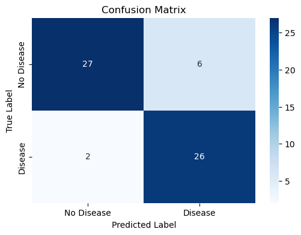
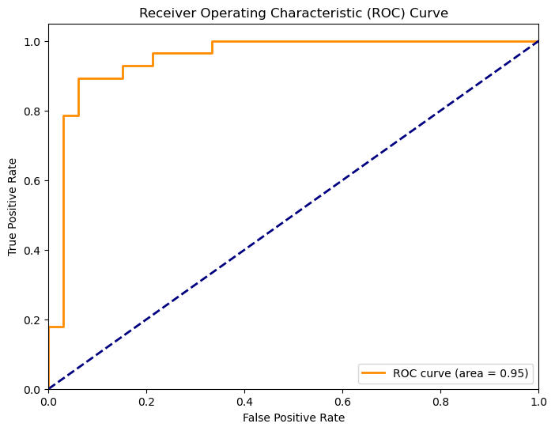
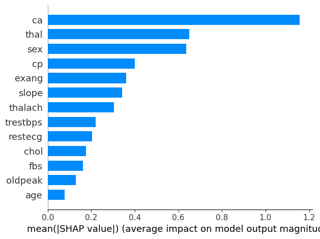
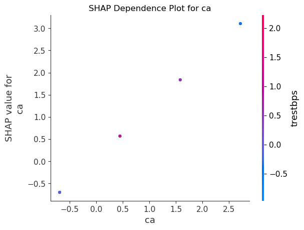

# Heart Disease Classification Pipeline

A full end-to-end machine learning pipeline for predicting the presence of heart disease using the UCI Heart Disease dataset. The project covers data ingestion, preprocessing, model training, evaluation, SHAP-based interpretability, and an interactive Streamlit front end.

---

## Table of Contents

- [Overview](#overview)
- [Project Structure](#project-structure)
- [Dataset](#dataset)
- [Installation](#installation)
- [Usage](#usage)
- [Pipeline Architecture](#pipeline-architecture)
- [Model Performance](#model-performance)
- [SHAP Interpretability](#shap-interpretability)
- [Streamlit App](#streamlit-app)
- [Testing](#testing)
- [Results](#results)

---

## Overview

This project builds a binary classification model to predict whether a patient has heart disease based on 13 clinical features. The multi-class target variable (`num`) from the original UCI dataset is binarised into presence (1) or absence (0) of disease.

The pipeline is structured as a proper Python package rather than a monolithic notebook, with separate modules for data processing, training, evaluation and configuration. The full workflow runs end-to-end from a single entry point.

---

## Project Structure

```
heart-disease-classifier/
│
├── src/
│   ├── __init__.py
│   ├── config.py                          # Paths, constants, logging setup
│   ├── data_processing.py                 # Data fetching, binarisation, train/test split
│   ├── pipeline.py                        # Preprocessing pipeline (imputation + scaling)
│   ├── train.py                           # Model training and pipeline saving
│   └── evaluate.py                        # Metrics, confusion matrix, ROC curve, SHAP
│
├── notebooks/
│   ├── 01_data_loading.ipynb              # EDA and data inspection
│   ├── 02_preprocessing.ipynb             # Model training walkthrough
│   └── 03_Evaluation_Interpretation.ipynb # Evaluation metrics and SHAP analysis
│
├── tests/
│   ├── __init__.py
│   └── test_data_processing.py            # Unit tests for data pipeline
│
├── data/                                  # Auto-generated on first run
│   ├── heart_disease_raw.csv              # Raw dataset fetched from UCI
│   └── X_processed.csv                   # Scaled and imputed features
│
├── models/                                # Auto-generated after training
│   └── logistic_regression_pipeline.joblib
│
├── logs/                                  # Auto-generated on first run
│   ├── pipeline.log                       # Full run log
│   ├── logistic_regression_confusion_matrix.png
│   ├── logistic_regression_roc_curve.png
│   ├── logistic_regression_shap_summary_bar.png
│   ├── logistic_regression_shap_summary_dot.png
│   └── logistic_regression_shap_dependence_ca.png
│
├── app.py                                 # Streamlit web application
├── main.py                                # CLI entry point for full pipeline run
├── pytest.ini                             # Pytest markers config
├── .gitignore
└── requirements.txt
```

---

## Dataset

The project uses the **UCI Heart Disease dataset** (ID: 45), fetched directly via the `ucimlrepo` API.

- **303 patients**, 13 clinical features
- **Target variable**: binarised from multi-class `num` to `0` (no disease) / `1` (disease present)
- **Class distribution**: approximately 54% negative, 46% positive
- **Missing values**: `ca` (4 missing) and `thal` (2 missing), handled via median imputation

| Feature | Description |
|---|---|
| `age` | Age in years |
| `sex` | Sex (1 = male, 0 = female) |
| `cp` | Chest pain type (1–4) |
| `trestbps` | Resting blood pressure (mm Hg) |
| `chol` | Serum cholesterol (mg/dl) |
| `fbs` | Fasting blood sugar > 120 mg/dl |
| `restecg` | Resting electrocardiographic results |
| `thalach` | Maximum heart rate achieved |
| `exang` | Exercise induced angina |
| `oldpeak` | ST depression induced by exercise |
| `slope` | Slope of peak exercise ST segment |
| `ca` | Number of major vessels coloured by fluoroscopy |
| `thal` | Thalium stress test result |

---

## Installation

```bash
git clone https://github.com/MontzCode/heart-disease-classifier.git
cd heart-disease-classifier
pip install -r requirements.txt
```

**Key dependencies:**

```
scikit-learn
pandas
numpy
ucimlrepo
shap
matplotlib
seaborn
streamlit
joblib
pytest
```

---

## Usage

### Run the full pipeline via CLI

```bash
# Train and evaluate
python main.py --model logistic_regression

# Skip training and load existing saved model
python main.py --model logistic_regression --skip-train
```

### Run the Streamlit app

```bash
streamlit run app.py
```

### Run notebooks in order

```
notebooks/01_data_loading.ipynb
notebooks/02_preprocessing.ipynb
notebooks/03_Evaluation_Interpretation.ipynb
```

---

## Pipeline Architecture

The Scikit-learn pipeline handles all preprocessing and classification in a single object, preventing data leakage between train and test sets.

```
Input features (13 clinical variables)
        |
        v
SimpleImputer (strategy='median')   <-- handles missing values in ca and thal
        |
        v
StandardScaler                      <-- normalises all features
        |
        v
LogisticRegression
  - solver: liblinear
  - class_weight: balanced          <-- accounts for class imbalance
  - max_iter: 1000
  - random_state: 42
        |
        v
Binary prediction (0 = No Disease, 1 = Disease)
```

The trained pipeline is serialised using `joblib` and saved to `models/logistic_regression_pipeline.joblib`.

---

## Model Performance

Evaluated on a held-out test set (20% split, stratified).

| Metric | Score |
|---|---|
| Accuracy | 87% |
| ROC-AUC | 0.95 |
| Recall (Disease class) | 93% |
| True Positives | 26 |
| False Negatives | 2 |

Given the clinical context, recall was prioritised over raw accuracy to minimise false negatives — cases where heart disease is missed entirely.

### Confusion Matrix



### ROC Curve



---

## SHAP Interpretability

SHAP (SHapley Additive exPlanations) was used to understand feature contributions to model predictions. A `LinearExplainer` was applied to the logistic regression model after transforming the test data through the preprocessing step.

### Feature Importance (Bar)



### Feature Impact (Dot)


### Key Findings

`ca` (number of major vessels coloured by fluoroscopy) was by far the most influential feature, with higher values strongly associated with disease presence. `thal` and `sex` followed as the next most impactful features. Age, despite its clinical relevance, ranked lowest in terms of model influence on this dataset.

### Dependence Plot — `ca`



---

## Streamlit App

An interactive front end built with Streamlit allows clinicians or researchers to input patient values and receive a real-time prediction with probability score.

```bash
streamlit run app.py
```

The app loads the saved pipeline via `@st.cache_resource`, collects all 13 feature inputs through a structured form, and outputs the predicted class alongside the probability of disease presence.

---

## Testing

Unit tests are written with `pytest`. Tests marked `network` require internet access to fetch the dataset from UCI.

```bash
# Run all tests
pytest

# Run only local tests (skip network)
pytest -m "not network"
```

Tests cover return types and shapes from `fetch_and_prepare_data`, binary target validation, and correct column dropping after binarisation.

---

## Logging

All pipeline stages log to both console and `logs/pipeline.log`. Log entries include data fetch status, missing value warnings, split shapes, training completion and evaluation metrics.
